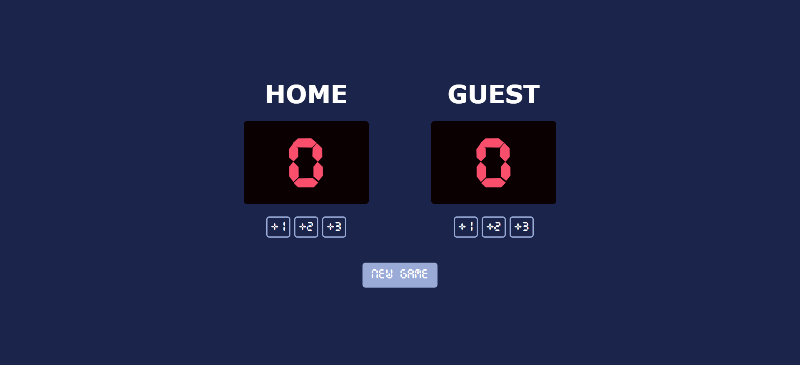

# 🏀 Basketball Scoreboard

A solo project from the [Scrimba Frontend Developer Career Path](https://scrimba.com/frontend-path-c0j).  
This project is a **basketball-style scoreboard** where users can track scores for both **Home** and **Guest** teams in real time. Each team’s score can be increased by 1, 2, or 3 points, and the game can be reset anytime with the **New Game** button.

## 🛠️ Technologies
- HTML5  
- CSS3  
- JavaScript (ES6)

## 🚀 Features
- Six interactive buttons that correctly update scores for **Home** and **Guest** teams.  
- A **New Game** button that resets all scores to zero.  
- Uses **data attributes** and **event listeners** for efficient score updates.  
- Styled with a **digital scoreboard font** for a realistic look.  
- Clean, responsive, and centered layout.

## 🧠 What I Learned / Process
- Practiced **DOM manipulation** and **event handling** in JavaScript.  
- Used **objects** to organize related data (team names, scores, elements).  
- Learned to use **dataset attributes (`data-*`)** for clean event logic.  
- Improved understanding of **flexbox layout** and **custom font integration** in CSS.  

## 💡 Future Improvements
- Highlight the **leading team** dynamically.  
- Add **additional counters** such as:
  - Game period  
  - Team fouls  
  - Countdown timer  
- Implement **dark/light mode** for better visual experience.  
- Store scores in **local storage** to persist data after page reloads.

## 🖼️ Preview

## 📚 Sources & References
- Scrimba course: [Scrimba Frontend Developer Career Path](https://scrimba.com/frontend-path-c0j)  
- Figma Design reference by Scrimba: [View Figma Design](https://www.figma.com/design/YC48MCx4frBFtYoz6rNJE6/Basketball-Scoreboard?node-id=0-1&p=f&t=EtxyyQtB3vZFm3YL-0)
